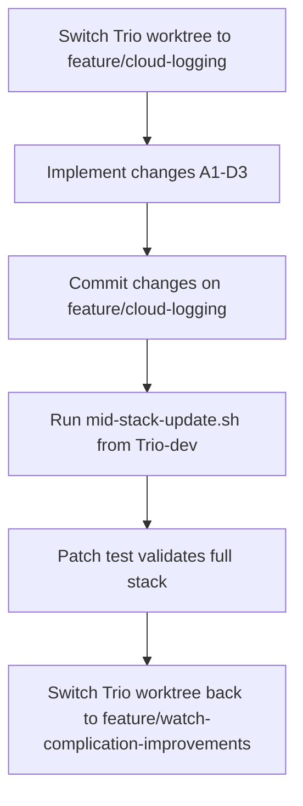

# Logging Fixes Implementation (v1.8) — COMPLETE

## Changelog

| Version | Date | Changes |
|---------|------|---------|
| v1.8 | 2026-03-13 | **Project complete.** Phase 2 committed (feature/cloud-logging `a49bf06a7`, feature/watch-complication-improvements `63abe736e`), patches 06+09 regenerated via `--from-feature-branch`, deployed as build 138. Production verified: [DEPLOY], [UPGRADE], [INVENTORY], [CLEANUP] events confirmed in BetterStack; debug view operational; pending files draining to 0. Moved to `docs/completed/`. |
| v1.7 | 2026-03-13 | `flushToPhone` crash-safety fix: `storePendingPayload` before `sendMessage` in reachable path (pre-existing bug). Updated reference doc versions. |
| v1.6 | 2026-03-13 | Phase E + A3b implemented. `outcome=error` on unexpected delete failures. Pending record removal conditioned on file deletion success (orphan prevention). Inline metric fields renamed `watch_log_files=`/`drain_files=`. Code review round 3 incorporated. |
| v1.5 | 2026-03-13 | Added Task A3b (cache dateFormatter in SimpleLogReporter) — deferred perf fix from A3, ships with Phase E. Updated overview to reflect deployed build 137. Broader perf audit tracked in `docs/backlog/perf-optimizations/`. |
| v1.4 | 2026-03-13 | Outcome tracking changed from `fileExists` pre-check to attempt-then-catch (`NSFileNoSuchFileError` = `outcome=missing`); simpler and eliminates redundant filesystem call. Added `[b:BUILD]` positional extraction clarification to parser constraint (anchored to position after timestamp, not a global search). Added E4 cross-branch dependency note (E1–E3 must land before E4 if storage APIs change). |
| v1.3 | 2026-03-13 | Error sanitization: `error=` field must be a machine-parseable token (spaces→underscores, ≤50 chars); added `sanitizeError()` helper requirement. Confirm path emits per-artifact-type events (`watch_log`, `pending_record`, `drain` separately) so partial failures are attributable. Documented `ack_reply` file+record atomic pairing. Moved plan file from `docs/completed/` to `docs/in-progress/logging-fixes/`. |
| v1.2 | 2026-03-12 | Phase 2 schema tightening: renamed `file=` to `artifact=`, defined explicit single-delete vs batch event shapes with canonical field mapping table, replaced multi-ID `payloadId` with bounded `sample_ids=`, added `outcome=deleted\|missing` sub-field for idempotent operations, defined `updateCachedCountsIfStale()` with 10s TTL for inline metrics, added in-flight guard to debug view refresh. |
| v1.1 | 2026-03-12 | Added Phase 2: cleanup observability (E1–E4). Incorporates external code review feedback on event schema granularity, retention logging, performance constraints, and async debug view loading. |
| v1.0 | 2026-03-12 | Initial plan: Phase 1 logging pipeline fixes (A1–D3), all completed. |

---

## Phase 1: Logging Pipeline Fixes (complete)

Implements design doc v1.4 and implementation plan v1.5 from `docs/in-progress/logging-fixes/`.

### Branch and Patch Strategy

- **Implementation branch**: `feature/cloud-logging` (in the **Trio** worktree)
- **Current Trio worktree branch**: `feature/watch-complication-improvements` -- must switch to `feature/cloud-logging` first
- **Trio-dev worktree**: stays on `dev` (required for mid-stack-update.sh)
- **Patch**: `patches/06-cloud-logging.patch` -- mid-stack update (patches 07-09 follow)

#### Workflow



#### Mid-stack update command (from Trio-dev on dev)

```bash
./scripts/mid-stack-update.sh --patch 06 --cherry-pick <new-commit-sha(s)> --feature-branch feature/cloud-logging
```

If multiple commits are made, list all SHAs comma-separated in chronological order. The `--feature-branch` flag enables drift check to verify completeness.

### Key files (all paths relative to Trio worktree)

**Writers** (embed `[b:BUILD]`):

- [WatchLogger.swift](Trio%20Watch%20App%20Extension/WatchLogger.swift) -- actor, `log()` at line 114
- [ComplicationLogBuffer.swift](Trio%20Watch%20Shared/ComplicationLogBuffer.swift) -- static enum, `appendToFile()` at line 225
- [SimpleLogReporter.swift](Trio/Sources/Logger/IssueReporter/SimpleLogReporter.swift) -- final class, `log()` at line 45

**Parsers + Uploader** (extract embedded build):

- [CloudLogLineParsing.swift](Trio/Sources/Logger/CloudLogging/CloudLogLineParsing.swift) -- `CloudParsedLogLine` struct, `parseWatch()`, `parseIOS()`
- [CloudLogUploader.swift](Trio/Sources/Logger/CloudLogging/CloudLogUploader.swift) -- `uploadNewContent()` event loop at line 139

**Retention + flush**:

- [WatchLogger.swift](Trio%20Watch%20App%20Extension/WatchLogger.swift) -- `maxFileAge` (line 17), `maxPerPayloadFiles` (line 16), `flushPersistedLogs()` (line 234)
- [CloudLogUploadService.swift](Trio/Sources/Logger/CloudLogging/CloudLogUploadService.swift) -- `start()` at line 121

**Sentinels**:

- [TrioApp.swift](Trio/Sources/Application/TrioApp.swift) -- after line 84 (`CloudLogUploadService` resolution)
- [ExtensionDelegate.swift](Trio%20Watch%20App%20Extension/ExtensionDelegate.swift) -- `applicationDidFinishLaunching()` at line 4

**Drain file ACK fix**:

- [WatchState.swift](Trio%20Watch%20App%20Extension/WatchState.swift) -- `session(_:didReceiveMessage:)` at line 230, `session(_:didReceiveUserInfo:)` at line 286
- [AppleWatchManager.swift](Trio/Sources/Services/WatchManager/AppleWatchManager.swift) -- `recordProcessed()` sites at lines 1035, 1059, 1228

### Critical constraints

- `ComplicationLogBuffer` stays a static `enum`; use `private static let build`
- Keep Unicode arrow in watch log format
- Parser strategy: strip `[b:...]` token first, then run existing parsing unchanged. The `[b:...]` check is **positional** (anchored to the position immediately after the timestamp bracket via `^` on the remaining text), NOT a global search — `[b:...]` appearing in message content (after `→`) is never scanned
- `WatchState` is a class (not an actor); use `Task {}` not `Task.detached {}`
- Phone-to-watch signaling via `WatchConnectivity` only (App Group not shared across devices)
- One confirmation per payload; `isProcessed()` naturally prevents duplicates
- Write `lastKnownBuild` to UserDefaults *before* the drain call (interruption safety)
- `debug(.service, ...)` for iOS sentinel; category is `service`, not `DEPLOY`
- Drain file deletion: exact filename match only, no substring/recursive

### Reference docs

- [Design doc (v1.11)](logging-fixes-design-doc.md)
- [Implementation plan (v1.14)](logging-fixes-implementation-plan.md)
- [Idea doc](logging-fixes-idea.md)

---

## Phase 2: Cleanup Observability

### Problem

WatchLogger has **5 distinct file deletion sites** plus retention-based deletions. Only 3 of 5 log anything, none use consistent terminology, and the most common cleanup path (ACK reply) uses different wording than `deleteFilesForPayloadIds`. This makes it impossible to query BetterStack for "all cleanup events" or verify that cleanup is functioning.

### Current state: deletion sites in WatchLogger.swift

| Line | What's deleted | Current log | Cleanup path |
|------|----------------|-------------|--------------|
| 152 | `watch_log_*.txt` via flushToPhone ACK reply | "Logs ACK received from phone" | ACK reply (flush) |
| 259 | `watch_log_*.txt` via queryAcks reply | **None** | queryAcks reply |
| 331 | Pending file via resendPendingPayloads ACK | "Resent logs ACK received" | ACK reply (resend) |
| 408/414 | Pending file + drain file via deleteFilesForPayloadIds | "Cleaned up N payload(s)" | confirm/batchAck handler |
| 538 | Drain file via sendLogContentFromFile ACK | **None** | ACK reply (drain) |
| 218/231 | Age/count retention for watch_log files | **None** | Retention |
| 450/457 | Age/count retention for drain files | **None** | Retention |

### Event schema

All cleanup events use the `[CLEANUP]` tag with structured key=value fields. There are two distinct event shapes:

**Single-delete shape** (one artifact per event):

```
⌚️ [CLEANUP] path=<path> flow=<flow> artifact=<type> payloadId=<id> outcome=<deleted|missing> result=<ok|err> [error=<short>]
```

**Batch/retention shape** (multiple artifacts per event):

```
⌚️ [CLEANUP] path=<path> artifact=<type> count=<n> [deleted=<n> remaining=<n> oldest_age_hours=<h>] [sample_ids=<id1>|<id2>|<id3>] result=<ok|err>
```

**Fields:**

| Field | Values | Required by | Purpose |
|-------|--------|-------------|---------|
| `path` | `ack_reply`, `query_acks`, `confirm`, `retention` | All events | Which code path triggered the deletion |
| `flow` | `flush`, `resend`, `drain` | `path=ack_reply` only | Discriminates the 3 ACK reply sites |
| `artifact` | `watch_log`, `drain`, `pending_record` | All events | What type of artifact was deleted (file or UserDefaults record) |
| `payloadId` | UUID string | Single-delete only | Correlates with flush/send log lines |
| `outcome` | `deleted`, `missing`, `error` | Single-delete only | Whether file was removed (`deleted`), already gone (`missing`), or removal failed (`error`) |
| `count` | integer | Batch/retention only | How many items were processed |
| `deleted` | integer | `path=retention` only | How many items were actually removed |
| `remaining` | integer | `path=retention` only | Files remaining after cleanup |
| `oldest_age_hours` | integer | `path=retention` only | Age of oldest deleted file (diagnostic: suggests ACK/confirm paths are broken if large) |
| `sample_ids` | `id1\|id2\|id3` (max 3, pipe-delimited) | `path=confirm` only (optional) | Bounded sample for correlation without high-cardinality |
| `result` | `ok`, `err` | All events | Whether the operation succeeded |
| `error` | sanitized token (≤50 chars, no spaces/newlines) | Only when `result=err` | What went wrong; machine-parseable (see sanitization note below) |

**Canonical per-path field mapping:**

| `path` | Required fields | Optional fields | Never present |
|--------|----------------|-----------------|---------------|
| `ack_reply` | `flow`, `artifact`, `payloadId`, `outcome`, `result` | `error` | `count`, `deleted`, `remaining`, `oldest_age_hours`, `sample_ids` |
| `query_acks` | `artifact`, `count`, `result` | `error` | `flow`, `payloadId`, `outcome`, `deleted`, `remaining`, `oldest_age_hours`, `sample_ids` |
| `confirm` | `artifact`, `count`, `result` | `sample_ids`, `error` | `flow`, `payloadId`, `outcome`, `deleted`, `remaining`, `oldest_age_hours` |
| `retention` | `artifact`, `deleted`, `remaining`, `oldest_age_hours`, `result` | `error` | `flow`, `payloadId`, `outcome`, `count`, `sample_ids` |

**Error sanitization:** The `error` field must be a machine-parseable token: replace spaces with underscores, strip special characters, truncate to 50 characters, no newlines. For `NSError`, prefer `<domain>_<code>` (e.g., `NSCocoaErrorDomain_4`). Fallback: sanitize `localizedDescription`. Never emit raw `localizedDescription` — it can contain spaces, quotes, and newlines that break key=value parsing and BetterStack filters. Implement a small `sanitizeError(_ error: Error) -> String` helper in WatchLogger.

**Artifact type separation (`confirm` path):** `deleteFilesForPayloadIds` processes multiple artifact types per call (watch_log files, pending records, drain files). To ensure partial failures are attributable, the `confirm` path emits **one `[CLEANUP]` event per artifact type** rather than one combined event. If watch_log deletes succeed but pending record removal fails, the per-type events make this visible.

**Artifact pairing (`ack_reply` paths):** For `ack_reply` paths, the pending record is only removed when file deletion succeeds (including `outcome=missing`). On `outcome=error`, the pending record is **kept** so `resendPendingPayloads` can retry. The `artifact=` value reflects the primary artifact (the file); no separate `artifact=pending_record` event — the pairing is always 1:1.

**Pending record safety (`confirm` path):** Same principle — `deleteFilesForPayloadIds` only removes the pending record for a given payloadId when the corresponding watch_log file deletion succeeds. If the file delete fails, the record is preserved for retry on the next activation cycle.

**Examples:**

```
⌚️ [CLEANUP] path=ack_reply flow=flush artifact=watch_log payloadId=16265DA9 outcome=deleted result=ok
⌚️ [CLEANUP] path=ack_reply flow=drain artifact=drain payloadId=ABCD1234 outcome=missing result=ok
⌚️ [CLEANUP] path=query_acks artifact=watch_log count=3 result=ok
⌚️ [CLEANUP] path=confirm artifact=watch_log count=2 result=ok
⌚️ [CLEANUP] path=confirm artifact=pending_record count=2 result=ok
⌚️ [CLEANUP] path=confirm artifact=drain count=1 sample_ids=ABCD1234 result=ok
⌚️ [CLEANUP] path=retention artifact=watch_log deleted=7 remaining=3 oldest_age_hours=52 result=ok
⌚️ [CLEANUP] path=retention artifact=drain deleted=2 remaining=8 oldest_age_hours=49 result=ok
⌚️ [CLEANUP] path=ack_reply flow=flush artifact=watch_log payloadId=16265DA9 outcome=deleted result=err error=NSCocoaErrorDomain_4
```

**Retention logging:** Only emit when deleted > 0 (zero noise when nothing is cleaned up). Single summary line per retention pass, not per-file.

**BetterStack queries:**
- All cleanup: `LIKE '%[CLEANUP]%'`
- Failures only: `LIKE '%[CLEANUP]%' AND LIKE '%result=err%'`
- By path: `LIKE '%[CLEANUP] path=ack_reply%'`
- By flow: `LIKE '%flow=drain%'`
- No-ops (file already gone): `LIKE '%outcome=missing%'`

### Change E1: Unified `[CLEANUP]` logging (feature/cloud-logging)

Add or update log messages at all deletion sites:

| Site (line) | Current | New |
|-------------|---------|-----|
| 152 (flushToPhone ACK) | "Logs ACK received from phone for payloadId: ..." | `[CLEANUP] path=ack_reply flow=flush artifact=watch_log payloadId=<id> outcome=<deleted\|missing> result=ok` |
| 259 (queryAcks) | **None** | `[CLEANUP] path=query_acks artifact=watch_log count=<n> result=ok` |
| 331 (resend ACK) | "Resent logs ACK received for payloadId: ..." | `[CLEANUP] path=ack_reply flow=resend artifact=<type> payloadId=<id> outcome=<deleted\|missing> result=ok` |
| 408/414 (deleteFilesForPayloadIds) | "Cleaned up N payload(s)" | One `[CLEANUP] path=confirm artifact=<type> count=<n> result=ok` per artifact type (`watch_log`, `pending_record`, `drain`) |
| 538 (drain ACK) | **None** | `[CLEANUP] path=ack_reply flow=drain artifact=drain payloadId=<id> outcome=<deleted\|missing> result=ok` |
| 218/231 (watch_log retention) | **None** | `[CLEANUP] path=retention artifact=watch_log deleted=<n> remaining=<n> oldest_age_hours=<h> result=ok` (only when deleted > 0) |
| 450/457 (drain retention) | **None** | `[CLEANUP] path=retention artifact=drain deleted=<n> remaining=<n> oldest_age_hours=<h> result=ok` (only when deleted > 0) |

**Failure logging:** Convert `try?` to `do/catch` at deletion sites and log `result=err error=<sanitized>` on failure (using `sanitizeError()` helper — see error sanitization note above). The `try?` pattern silently swallows failures — this is where observability matters most.

**Outcome tracking:** For single-delete paths, determine `outcome=` by attempting `removeItem` and inspecting the error, not by checking `fileExists` first (avoids a redundant filesystem call and eliminates any theoretical TOCTOU concern). Pattern: attempt `removeItem`; success → `outcome=deleted`; catch `NSCocoaErrorDomain` code 4 (`NSFileNoSuchFileError`) → `outcome=missing result=ok`; catch other errors → `result=err error=<sanitized>`. This distinguishes actual cleanup from idempotent no-ops — critical for diagnosing whether cleanup is working or just "nothing existed to delete" due to earlier retention or path mismatch.

### Change E2: Daily `[INVENTORY]` log (feature/cloud-logging)

Add `logFileInventory()` to WatchLogger:

```
⌚️ [INVENTORY] watch_logs_count=3 watch_logs_bytes=12288 drains_count=2 drains_bytes=8192 pending_count=5
```

**Implementation details:**
- Rate-limited to once per 24 hours via `UserDefaults` timestamp (`lastInventoryTimestamp`)
- Uses file attributes (`FileAttributeKey.size`) for byte counts — never reads file contents
- Runs on the actor's serial queue (WatchLogger is an actor, so already off-main)
- **Trigger points:** Called from `flushPersistedLogs()` (runs on app activation) and `flushToPhone()` (runs on flush timer) — best-effort daily when the watch app runs at least once per day
- Scans two directories:
  - `Documents/logs/` → `watch_log_*.txt` files
  - `ComplicationLogBuffer.sharedContainerURL()/logs/` → `complication_log.drain.*.txt` files
- Counts pending payload records from UserDefaults

### Change E3: Inline metrics on existing log lines (feature/cloud-logging)

Enrich existing high-frequency log messages with cached file counts:

- `flushToPhone`: `"⌚️ Logs queued for background delivery (payloadId: ...) pending=5 drains=2"`
- ACK handlers: `"⌚️ [CLEANUP] ... remaining_pending=3"`

**Cache lifecycle:** Counts are cached in actor properties (`cachedPendingCount`, `cachedDrainsCount`, `cachedCountsTimestamp`). A helper `updateCachedCountsIfStale()` recomputes counts only if the cache is older than 10 seconds. Called at the start of `flushPersistedLogs()`, `flushToPhone()`, and before any `[CLEANUP]` log line that includes `remaining_pending=`. This ensures ACK-driven log lines (which fire outside the flush cycle) use reasonably fresh counts without per-event directory scans.

### Change E4: Watch debug view LOG FILES section (feature/watch-complication-improvements)

Add a new section to `ComplicationDebugView.swift`:

```
LOG FILES
Watch Logs:        3 files, 12 KB
Drain Files:       2 files, 8 KB
Pending Payloads:  5
```

**Implementation details:**
- Data loaded asynchronously in `.onAppear` and stored in `@State` properties
- No filesystem access during SwiftUI `body` recomputation
- Reads from both directories:
  - `Documents/logs/` for watch_log files
  - Shared container `logs/` for drain files
- Counts pending payloads from `WatchLogger.shared.getPendingPayloads()`
- Refreshes on "Refresh View" button tap (existing action)
- **In-flight guard:** `@State private var isLoadingLogFiles = false` — disables refresh button while loading to prevent overlapping scans from rapid taps

**Note:** The existing "Container Files: 5" row counts files in the App Group container root (non-recursive). It shows the `logs/` directory as one item but doesn't enumerate its contents. The new LOG FILES section provides the breakdown that's actually useful for debugging.

**Cross-branch dependency:** E4 depends on `WatchLogger.shared.getPendingPayloads()` and the directory layout (`Documents/logs/`, shared container `logs/`). E1–E3 (on `feature/cloud-logging`) do not change these APIs or paths — they add observability logging only. If a future E1–E3 change modifies the pending payload storage format or directory structure, E4 must be rebased after E1–E3 lands. Commit E1–E3 and regenerate patch 06 before implementing E4.

### Branch strategy

- **E1, E2, E3**: `feature/cloud-logging` → regenerate `patches/06-cloud-logging.patch`
- **E4**: `feature/watch-complication-improvements` → regenerate `patches/09-watch-complication-improvements.patch`

### Files modified

| Change | File | Branch |
|--------|------|--------|
| E1, E2, E3 | `Trio Watch App Extension/WatchLogger.swift` | `feature/cloud-logging` |
| E4 | `Trio Watch App Extension/Views/ComplicationDebugView.swift` | `feature/watch-complication-improvements` |

### Constraints

- WatchLogger is an actor — all filesystem access is already off-main
- File size via `FileAttributeKey.size` (metadata), never read content for inventory
- Inline metrics via `updateCachedCountsIfStale()` with 10s TTL — no per-event directory scans
- Debug view (E4): async load into `@State`, in-flight guard on refresh, no IO during body recompute
- Retention logs only emit when `deleted > 0`
- Convert `try?` to `do/catch` at deletion sites to capture errors
- Single-delete paths: attempt `removeItem`, catch `NSFileNoSuchFileError` (code 4) for `outcome=missing` — no `fileExists` pre-check

